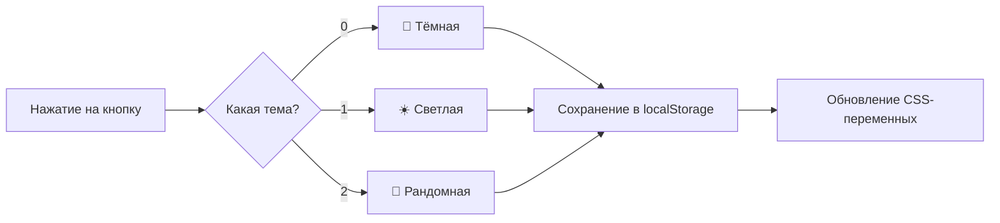

# 🐱 Портфолио-сайт Дарьи

> Персональный сайт-портфолио с тремя темами оформления и котиком 🐾

[](https://dasha1000.github.io/portfolio_1/)
[]()

---

## 📖 О проекте

Это мой личный сайт-портфолио, где я собрала всё самое важное:

- ✅ Мои **навыки** и технологии
- ✅ **Проекты**, над которыми работала
- ✅ Мои **хобби** (и фото кошки!)
- ✅ Переключение между **3 темами** оформления

Сайт полностью адаптивен и работает на всех устройствах.

---

## ✨ Особенности

| Фича | Описание |
|------|----------|
| 🎨 **3 темы** | Тёмная, светлая и рандомная (уникальный цвет при каждом клике!) |
| 💾 **Сохранение** | Выбранная тема запоминается в браузере |
| 📱 **Адаптив** | Красиво смотрится на телефонах, планшетах и компьютерах |
| 🐱 **Котик** | Отдельный блок с фото моего пушистого друга |
| 🔗 **Соцсети** | Иконки с эффектом красной тени при наведении |

---

## 🛠️ Технологии

<div align="center">
  


</div>

---

## 🚀 Быстрый старт

### 1️⃣ Склонировать репозиторий

```bash
git clone https://github.com/dasha1000/portfolio_1.git
```

### 2️⃣ Перейти в папку

```bash
cd portfolio_1
```

### 3️⃣ Открыть в браузере

Просто откройте `index.html` в любом браузере — готово! 🎉

---

## 📁 Структура проекта

```
portfolio_1/
│
├── 📄 index.html          # Главный файл (вся вёрстка + скрипты)
├── 🐱 cat.jpg             # Фото кошки (добавь свой файл!)
└── 📝 README.md           # Этот файл
```

---

## ✏️ Как настроить под себя

### 🔹 Изменить имя и описание

Найди в `index.html` эти строки:

```html
<h1>Дарья В.</h1>
<p>Создаю чистый, масштабируемый код. Java, Kotlin, Python — мой стек.</p>
```

### 🔹 Обновить ссылки на соцсети

```html
<a href="https://github.com/твой-ник" aria-label="GitHub">
  <i class="fab fa-github"></i>
</a>
```

### 🔹 Добавить свои навыки

Скопируй карточку навыка и измени иконку и название:

```html
<div class="skill-card">
  <div class="skill-icon"><i class="fab fa-java"></i></div>
  <div class="skill-name">Java</div>
  <div class="skill-level">
    <span class="filled"></span>
    <span class="filled"></span>
    <span class="filled"></span>
    <span class="filled"></span>
    <span class="filled"></span>
  </div>
</div>
```

> 💡 **Уровни:** 5 точек = эксперт, 4 = продвинутый, 3 = средний

### 🔹 Заменить фото кошки

Просто замени файл `cat.jpg` в корневой папке на своё фото.  
Размер лучше выбрать квадратный (например, 500×500 пикселей).

---

## 🌐 Деплой на GitHub Pages

1. Залей проект в репозиторий на GitHub
2. Зайди в **Settings** → **Pages**
3. В разделе **Branch** выбери `main`
4. Нажми **Save**
5. Через пару минут сайт будет доступен по адресу:  
   `https://твой-username.github.io/portfolio_1/`

---

## 🎨 Как работает переключение тем



---

## 📸 Скриншоты

| Тёмная тема 🌙 | Светлая тема ☀️ | Рандомная тема 🎨 |
|----------------|-----------------|-------------------|
| *тёмный фон, светлый текст* | *светлый фон, тёмный текст* | *уникальная цветовая схема* |

---

## 🤝 Вклад в проект

Хотите что-то улучшить? Буду рада пул-реквестам!

1. Форкните проект
2. Создайте ветку: `git checkout -b feature/что-то-крутое`
3. Сделайте коммит: `git commit -m 'Добавила крутую фичу'`
4. Пуш: `git push origin feature/что-то-крутое`
5. Откройте Pull Request

---

## 📬 Контакты

- **GitHub:** [@dasha1000](https://github.com/dasha1000)
- **Email:** daria.dev@example.com
- **Telegram:** [@dasha_dev](https://t.me/dasha_dev)

---

<div align="center">
  
**⭐ Поставь звёздочку, если тебе понравился проект!** ⭐

Сделано с ❤️ и 🐱

</div>
